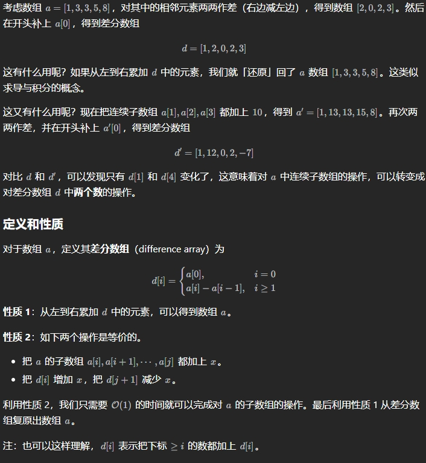
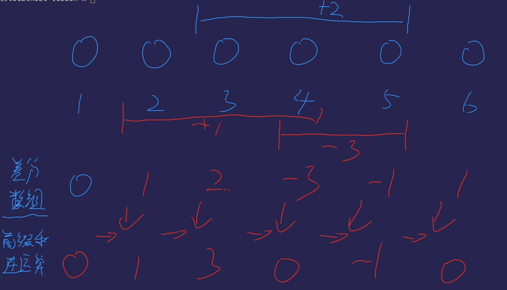
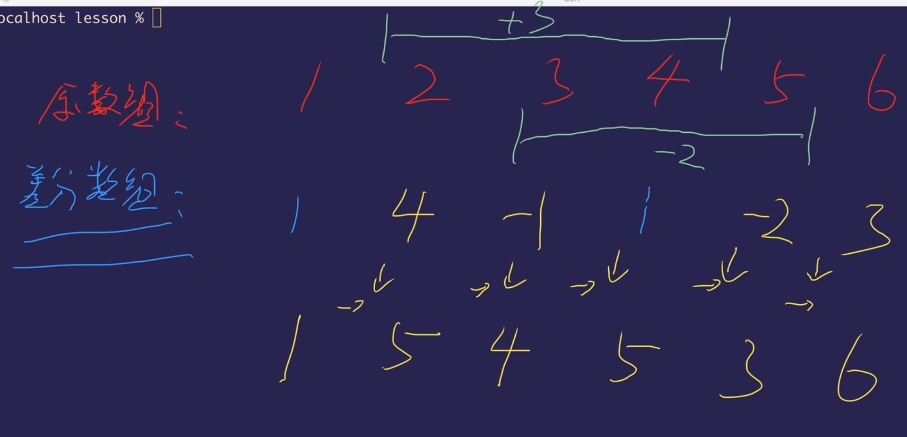
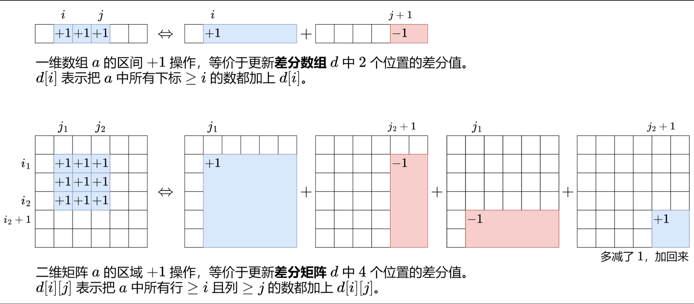
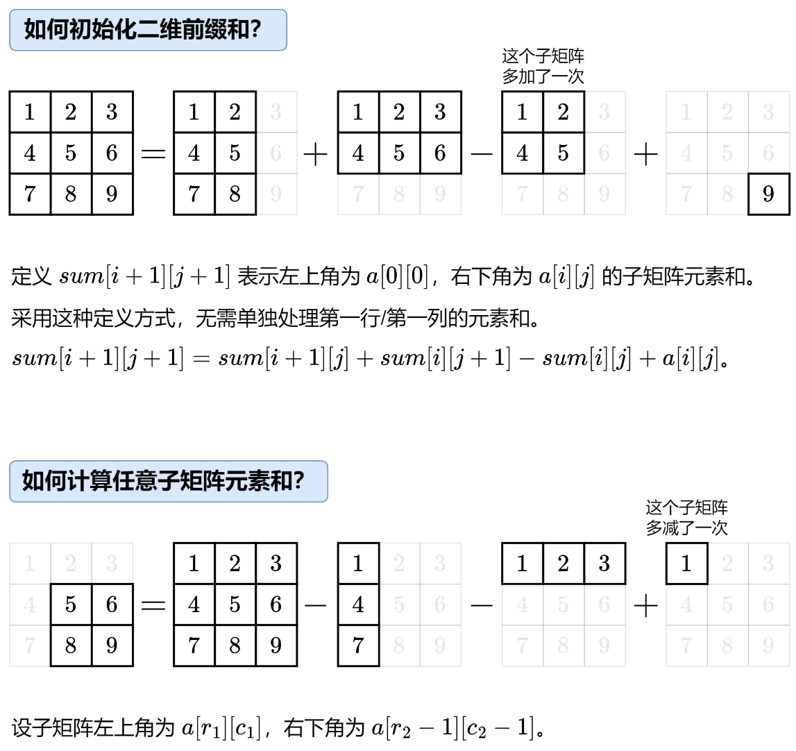

# 每日一提，开始啦

## c++中的auto、const auto&

+ 先介绍一下auto、const
+ 在块作用域、命名作用域、循环初始化语句等等 中声明变量时，关键词auto用作类型指定符。

+  `const`:修饰符

+ 接下来我们细细分析一下：

### （1）auto

> `auto即 for(auto x:range)` 这样会拷贝一份range元素，而不会改变range中元素；

   

> 但是！（重点) 使用`for(auto x:vector<bool>)`时得到一个proxy class,操作时会改变vector<bool>本身元素。应用：`for(bool x:vector<bool>)`

### （2）`auto&`

> 当需要修改range中元素，用`for(auto& x:range)`

  

> 当vector<bool>返回临时对象，使用`auto&`会编译错误，临时对象不能绑在`non-const l-value reference （左值引用）`需使用**auto&&**,初始化右值时也可捕获

### （3）`const auto&`  

> 当只想读取range中元素时，使用`const auto&`,如：`for(const auto&x:range),`它不会进行拷贝，也不会修改range  

### （4）`const auto`

> 当需要拷贝元素，但不可修改拷贝出来的值时，使用 `for(const auto x:range)`，避免拷贝开销                                                    

### 整理下：                                                                                                                          

> + **想要拷贝**元素：`for(auto x:range)`

> + **想要修改**元素 : `for(auto &&x:range)`

> + **想要只读**元素：for(const auto& x:range) 	

## Accumulate()函数

> accumulate是`numeric`库中的一个函数，主要用来对指定范围内元素求和，但也自行指定一些其他操作，如范围内所有元素相乘、相除等。

使用前需要引入相应的头文件。

```
#include <numeric>
```

- 函数共有四个参数，其中前三个为必须，第四个为非必需。
- 若不指定第四个参数，则默认对范围内的元素进行累加操作。

```
accumulate(起始迭代器, 结束迭代器, 初始值, 自定义操作函数)
```

## 二、具体使用场景

### 1. 计算数组中所有元素的和

```
#include <iostream>
#include <vector>
#include <numeric>
using namespace std;

int main() {
    vector<int> arr{1, 2, 3, 4, 5, 6, 7, 8, 9, 10};
    int sum = accumulate(arr.begin(), arr.end(), 0); // 初值0 + (1 + 2 + 3 + 4 +... + 10)
    cout << sum << endl;	// 输出55
    return 0;
}
```

### 2. 计算数组中所有元素的乘积

需要指定第四个参数，这里使用的是乘法函数` multiplies<type>()`, type根据元素的类型选择。

```
#include <iostream>
#include <vector>
#include <numeric>

using namespace std;

int main() {
    vector<int> arr{1, 2, 3, 4, 5, 6, 7, 8, 9, 10};
    int sum = accumulate(arr.begin(), arr.end(), 1, multiplies<int>()); // 初值1 * (1 * 2 * 3 * 4 *... * 10)
    cout << sum << endl;	// 输出3628800
    return 0;
}
```

### 3. 计算数组中每个元素乘以3之后的和

```
#include <iostream>
#include <vector>
#include <numeric>

using namespace std;

int fun(int acc, int num) {
    return acc + num * 3;     // 计算数组中每个元素乘以3
}

int main() {
    vector<int> arr{1, 2, 3, 4, 5, 6, 7, 8, 9, 10};
    int sum = accumulate(arr.begin(), arr.end(), 0, fun);
    cout << sum << endl;	// 输出 165
    return 0;
}
```

### 4.计算数组中每个元素减去3之后的和

```
#include <iostream>
#include <vector>
#include <numeric>

using namespace std;

int fun(int acc, int num) {
    return acc + (num - 3) ;     // 计算数组中每个元素减去3之后的和
}

int main() {
    vector<int> arr{1, 2, 3, 4, 5, 6, 7, 8, 9, 10};
    int sum = accumulate(arr.begin(), arr.end(), 0, fun);
    cout << sum << endl;    // 输出25
    return 0;
}
```

### 5.计算班级内学生的平均分

```
#include <iostream>
#include <vector>
#include <numeric>

using namespace std;

struct Student {
    string name;
    int score;
    Student() {};   // 无参构造函数
    Student(string name, int score) : name(name), score(score) {};  // 有参构造函数
};

int fun(int acc, Student b) {
    return a + b.score;
}

int main() {
    vector<Student> arr;
    arr.emplace_back("Alice", 82);
    arr.emplace_back("Bob", 91);
    arr.emplace_back("Lucy", 85);
    arr.emplace_back("Anna", 60);
    arr.emplace_back("June", 73);
    int avg_score = accumulate(arr.begin(), arr.end(), 0, fun) / arr.size();	// 总分/学生数
    cout << avg_score << endl;
    return 0;
}
```

### 6.拼接字符串

> C++中字符串之间也可以使用`+`，即拼接两个字符串。

```
#include <iostream>
#include <vector>
#include <numeric>

using namespace std;

int main() {
    vector<string> words{"this ", "is ", "a ", "sentence!"};
    string init, res;
    res = accumulate(words.begin(), words.end(), init);    // 连接字符串
    cout << res << endl;    // this is a sentence!
    return 0;
}
```

## 49. 字母异位词分组

> 一般需要对特征进行归类的优先想到——哈希表

> 递归求解伪装回文路径
```c++
int dfs(TreeNode* root, int bit) {
        if (!root) return 0;
        // 是使用异或运算来修改一个整数的特定位。
        bit ^= 1 << (root->val - 1); // 记录出现数字出现的次数的奇偶性
        cout << root->val << " " << bit << endl;
        int res = dfs(root->left, bit) + dfs(root->right, bit); // 递归求解左右子树的结果
        if (!root->left &&!root->right) {
            return (bit & (bit - 1))? 0 : 1; // 1个数字出现奇数次，其余都是偶数次
        }
        return res;
    }
```
> 用 1 标记原方向的边，使用 0 标记反向边(将原路径的正向的和反向的进行标记)

```c++
for (auto edge : connections) {
    e[edge[0]].push_back(make_pair(edge[1], 1));
    e[edge[1]].push_back(make_pair(edge[0], 0));
}

```
## 并查集

1. 定义数据结构

```c++
int fa[100010]; // fa[i]表示i的父亲
```

2. 定义查找函数

```c++
int find(int x){
	// 如果i的父亲是他自己，那么返回自己
	if(x==fa[x]) return x;
	// 如果不是的话
	else{
	// 找到他的父亲
	// 并且令他的父亲为他父亲的父亲
	// 即路径压缩
	fa[x]=find(fa[x]);
	// 返回他的父亲
	return fa[x];
}

```

> 进行简化

```c++
int find(int x){
	return fa[x]==x ? x : fa[x]=find(fa[x]);
}
```

3. 定义合并函数

```c++
void unity(int x,int y){
	// 将y的父亲指向x的父亲，即合并xy
	// 这里x和y可以互换位置，不影响最终结果
	fa[find(y)]=find(x);
}
```

## 差分数组（前缀和的逆运算）



### 区间加

+ a = [0,0,0,0,0,0]要求给下标2到4的位置+2
  + 差分数组：0  0  2  0  0  -2 （修改起始位2，和结束的后一位4+1 = 5）
  + 前缀和：   0   0  2  2  2   0
+ 

+ 

### leetcode 1094.cpp  拼车

```c++
class Solution {
public:
    bool carPooling(vector<vector<int>>& trips, int capacity) {
        // 差分数组(第一种写法)
        int a[1001]{};
        for(auto &el : trips){
            int num = el[0],from = el[1],to = el[2];
            a[from] += num;
            a[to] -= num;
        }
        int s= 0;
        for(int i= 0;i<1001;i++){
            s += a[i];
            if(s > capacity) return false;
        }
        return true;

        // 差分数组(第二种写法)
        map<int,int> m;
        for(auto &el : trips){
            int num = el[0],from = el[1],to = el[2];
            m[from] += num;
            m[to] -= num;
        }
        int s = 0;
        for(auto [_,vallue]: m){
            s += vallue;
            if(s > capacity) return false;
        }
        return true;
    }   
};
```

## 一维差分的思想可以推广至二维



### 二维前缀和



+ 模板

```c++
class MatrixSum {
private:
    vector<vector<int>> sum;

public:
    MatrixSum(vector<vector<int>> &matrix) {
        int m = matrix.size(), n = matrix[0].size();
        // 注意：如果 matrix[i][j] 范围很大，需要使用 long long
        sum = vector<vector<int>>(m + 1, vector<int>(n + 1));
        for (int i = 0; i < m; i++) {
            for (int j = 0; j < n; j++) {
                sum[i + 1][j + 1] = sum[i + 1][j] + sum[i][j + 1] - sum[i][j] + matrix[i][j];
            }
        }
    }

    // 返回左上角在 (r1,c1) 右下角在 (r2-1,c2-1) 的子矩阵元素和（类似前缀和的左闭右开）
    int query(int r1, int c1, int r2, int c2) {
        return sum[r2][c2] - sum[r2][c1] - sum[r1][c2] + sum[r1][c1];
    }

    // 如果你不习惯左闭右开，也可以这样写
    // 返回左上角在 (r1,c1) 右下角在 (r2,c2) 的子矩阵元素和
    int query2(int r1, int c1, int r2, int c2) {
        return sum[r2 + 1][c2 + 1] - sum[r2 + 1][c1] - sum[r1][c2 + 1] + sum[r1][c1];
    }
};
```

